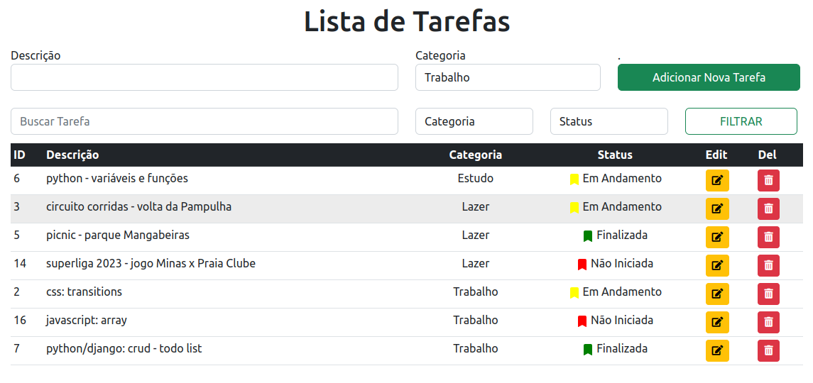

## TODO
### Python / Django

#### ambiente virtual
- python3 -m venv venv
- source venv/bin/activate

#### bibliotecas
- pip install django
- pip install pillow
- pip install python-dotenv

#### filtros
- por descrição
- por categoria
- por status

